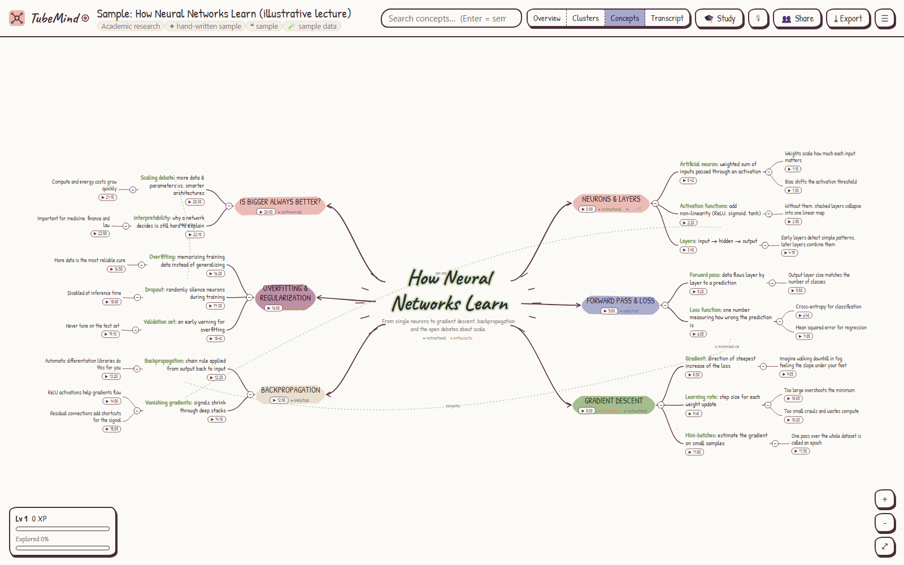
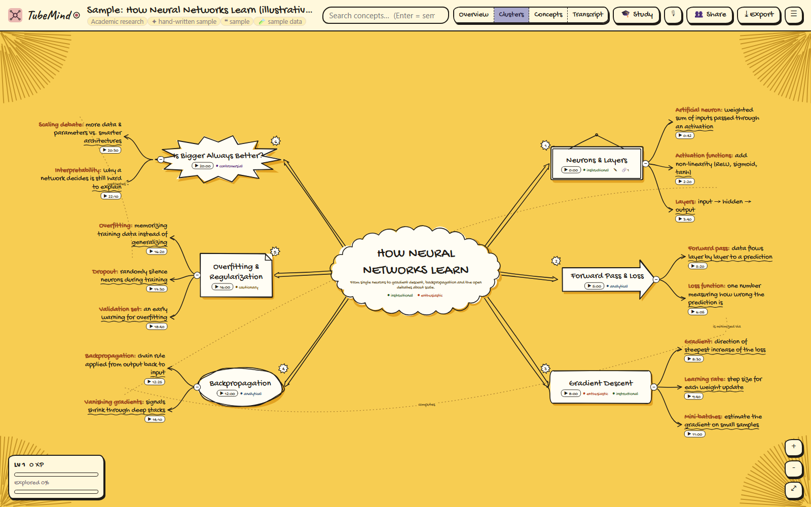
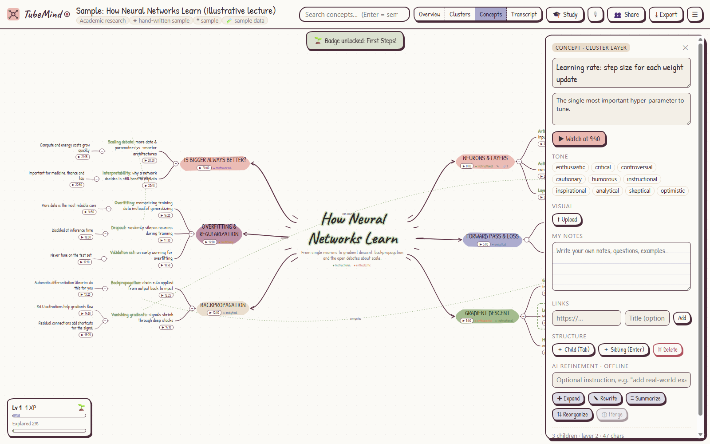
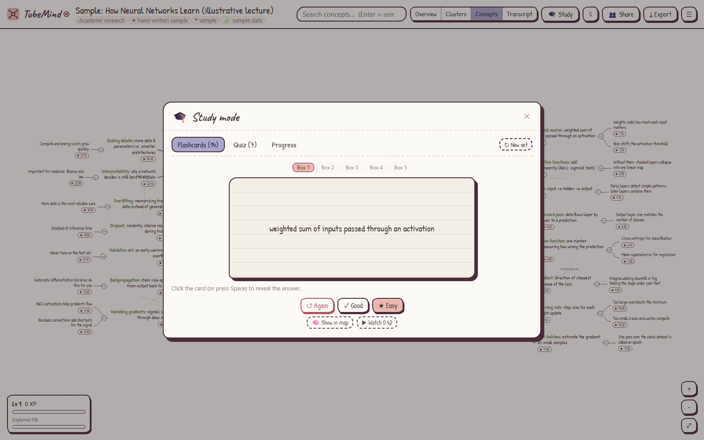
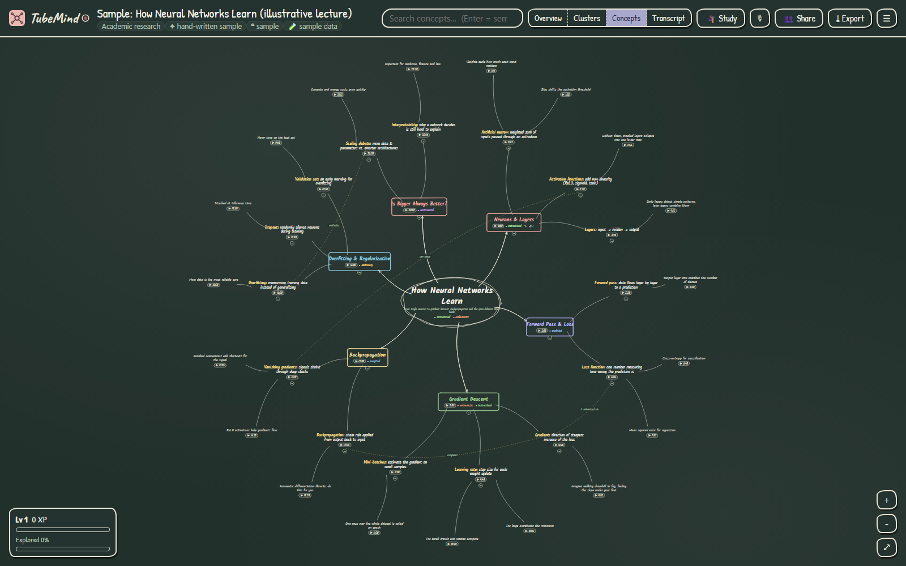
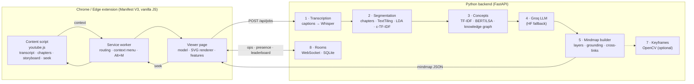

# 🧠 TubeMind: YouTube → Interactive Mindmap

TubeMind is a free, open-source (MIT) Chrome/Edge extension. It turns any YouTube video into a hand-drawn, **timestamp-linked**, **semantically layered** mindmap. Click a node and the video jumps to that moment. You can edit the map, study from it, collaborate on it live, and export it to Notion, Obsidian, Roam, Markdown, PNG and more.

| Sketch notes theme | Yellow doodle theme |
|---|---|
|  |  |

| Node inspector (notes, links, frames, AI) | Study mode | Blackboard + radial layout |
|---|---|---|
|  |  |  |

> The screenshots show the bundled **illustrative sample map** ("How Neural Networks Learn"). It is hand-written demo data and is not linked to a real video.

---

## Contents
- [Architecture](#-architecture)
- [Quick start](#-quick-start)
- [Using TubeMind](#-using-tubemind)
- [Demo: lecture → mindmap](#-demo-lecture--mindmap)
- [Configuration](#-configuration)
- [Backend API](#-backend-api)
- [Mindmap JSON schema](#-mindmap-json-schema)
- [Project structure](#-project-structure)
- [Design notes & limitations](#-design-notes--limitations)
- [Development & tests](#-development--tests)

---

## 🏗 Architecture



**Data flow:** Video URL → Transcript → Segmentation → Concept extraction → Groq LLM → Mindmap rendering → User interaction → Collaboration.

| # | Layer | Implementation |
|---|---|---|
| 1 | **Video transcription** | The content script scrapes the transcript the same way YouTube's "Show transcript" panel gets it (innertube `get_transcript`), then tries the caption-track JSON. The backend falls back to `youtube-transcript-api` (manual > auto > translated) and then to **Whisper** (`yt-dlp` audio + `faster-whisper`/`openai-whisper`). Captions are cleaned: noise tags, fillers, rolling duplicates and speaker markers. |
| 2 | **Content segmentation** | Creator chapters are used when they exist (player markers or `0:00 Intro` lines in the description). Otherwise a TextTiling-style algorithm finds depth-score valleys between adjacent block embeddings, with extra weight on speaker turns. LDA assigns a dominant topic, BERTopic-style **c-TF-IDF** picks keywords, and agglomerative clustering groups sections into themes. |
| 3 | **Key concept extraction** | Candidates are clause-bounded noun-phrase n-grams, or spaCy noun chunks and entities when installed. They are weighted by TF-IDF, and near-duplicates are merged with BERT embeddings (TF-IDF+SVD fallback). A **networkx knowledge graph** is built from co-occurrence and semantic edges, with PageRank importance, modularity communities, and relation labels ("uses", "leads to", "is a type of"…). |
| 4 | **Groq LLM** | Each segment gets one call. The prompt carries an extractively compressed excerpt with `[mm:ss]` markers plus the extracted concepts. The LLM returns hierarchical JSON nodes such as *"Qubits: fundamental unit of quantum computing"*. A root call writes the central idea and cross-section links. It handles rate limits and retries on `GROQ_FALLBACK_MODEL`. If Groq is unavailable, it uses the **Hugging Face** router or a local `transformers` model, then deterministic heuristics. |
| 5 | **Mindmap generation** | Nodes are built in semantic layers: `0 root → 1 sections → 2 concepts → 3 details → 4 transcript leaves`. Every node's timestamp is **grounded**, meaning it snaps to the most similar real transcript sentence. A zero-dependency hand-drawn SVG renderer draws the map in balanced-clockwise, radial or tree layouts. |
| 6 | **User interaction** | Expand/collapse, inline editing, notes, links, images, cross-links, undo/redo, semantic search, AI refine (expand · rewrite · summarize · reorganize · merge), keyboard navigation, and exports (JSON, PNG, SVG, Markdown, Obsidian, Roam, OPML, Notion). |
| 7 | **Multimodal** | Frames are cropped from YouTube **storyboard sprites** (free and instant, no download). You can also **capture the playing frame** or upload an image. Optionally, the server uses OpenCV to find slide and chart keyframes. |
| 8 | **Collaboration** | Self-hosted WebSocket rooms provide real-time ops, presence, SQLite cloud sync, and merging of divergent maps. |

**Advanced features:** adaptive learning profiles (visual / balanced / text-heavy, learned from behaviour) · cross-video knowledge linking ("Knowledge Hub") · emotion & tone tags · study mode (Leitner flashcards + quizzes) · context-aware summarization modes (quick revision / academic / deep exploration) · voice-interactive navigation · gamified collaboration (XP, badges, team challenges, leaderboard) · exports to Notion / Obsidian / Roam.

---

## 🚀 Quick start

### 1. Backend (Python 3.10+)

```bash
cd backend
python -m venv .venv
# Windows: .venv\Scripts\activate      macOS/Linux: source .venv/bin/activate
pip install -r requirements.txt          # lightweight core, no torch needed
python -m app.main                       # → http://127.0.0.1:8765
```

Create a `.env` file at the **project root** (copy `.env.example`) and add your free Groq key from <https://console.groq.com/keys>:

```env
GROQ_API_KEY=your_api_key_here
```

The backend loads it with `os.getenv("GROQ_API_KEY")` (see [`backend/app/config.py`](backend/app/config.py)). The key never reaches the browser.

**Optional "full power" extras** add BERT embeddings, Whisper, slide keyframes, spaCy and a local LLM:

```bash
pip install -r requirements-ml.txt
python -m spacy download en_core_web_sm
```

Each extra is detected automatically. `GET /api/health` shows what is active.

### 2. Extension (Chrome or Edge)

1. Open `chrome://extensions` (or `edge://extensions`) and turn on **Developer mode**.
2. Click **Load unpacked** and select the [`extension/`](extension) folder.
3. Pin **TubeMind**. The popup's status dot turns green when the backend is reachable.

### 3. Generate

Open any YouTube video and click the **🧠 Mindmap** button under the player. You can also press **Alt+M**, right-click the page, or use the toolbar popup, where you can also paste any video link. A viewer tab opens, shows the pipeline progress, and draws the map.

---

## 🧭 Using TubeMind

| Action | How |
|---|---|
| Jump to the video moment | Click a **▶ 1:23** chip, press **p**, or say "play" |
| Follow along | While the video plays, the matching node gets a moving red outline |
| Semantic layers | **Overview · Clusters · Concepts · Transcript** buttons, or keys **1–4** |
| Select / multi-select | Click / Shift+click |
| Edit | Double-click, **F2** or **e**. **Tab** adds a child, **Enter** adds a sibling, **Delete** removes |
| Expand / collapse | Click the ⊖ bubble or press **Space** |
| Navigate | Arrow keys · wheel/pinch to zoom · drag to pan · **f** to fit |
| Notes, links, images, tone | Node inspector (right panel): 🎞 storyboard frame, 📸 capture the current frame, ⬆ upload |
| Cross-link two nodes | Select two nodes, then **⤳ Cross-link** in the inspector |
| AI refinement | Right-click a node, or use the inspector's AI buttons. Add an optional instruction ("add real-world examples") |
| Search | `/` or Ctrl+F. Typing filters instantly; **Enter** runs embedding-based semantic search |
| Study | **🎓 Study**: flashcards with 5 Leitner boxes, a quiz, and progress. Mastered nodes get a ✓ on the map |
| Voice | **🎙**, then say e.g. "expand entanglement", "go to backpropagation", "read", "next", "zoom in", "layer overview", "add note check the paper", "stop listening" |
| Collaborate | **👥 Share** creates a room code. Others use **Join room**. Presence dots show who is where. **Merge my version** merges edits made offline |
| Cross-video knowledge | ☰ → **Library**, select 2+ videos, **🔗 Link knowledge**. This builds a *Knowledge Hub* whose leaves jump into each source video |
| Themes / layouts / profile | ☰ menu: Sketch notes · Yellow doodle · Blackboard; Balanced · Radial · Logical tree; Visual · Balanced · Text-heavy |
| Export | **⤓ Export**: PNG · SVG · JSON · Markdown · Obsidian · Roam JSON · OPML · Notion (.md import, or API push) |

Maps are saved automatically to IndexedDB in your browser. Drag a `.tubemind.json` file onto the canvas to import it.

---

## 🎬 Demo: lecture → mindmap

**Without a backend:** click **🧪 Demo** in the popup. The bundled sample lecture map opens with sections, concepts, details, transcript leaves, cross-links and tone tags. Try the layer buttons, study mode and exports.

**With the real pipeline, from the command line** (no extension needed):

```bash
cd backend
python -m app.cli "https://www.youtube.com/watch?v=<LECTURE_ID>" --mode academic --out ../examples/my-lecture.json
```

```
▶ video <LECTURE_ID> | LLM: groq:llama-3.3-70b-versatile | embeddings: tfidf-lsa
[████████████████████████] 100.0%  Done
• Central idea [0:00]
   • Section title [2:14]
      • Term: meaning written by the LLM [2:31]
         • supporting detail [2:48]
✔ wrote ../examples/my-lecture.json in 21.4s (youtube-captions transcript)
```

Open the JSON in the viewer (☰ → Library → Import, or drag it onto the canvas). Every node's ▶ chip jumps to its moment in the lecture. Use layers 1→4 to move from the overview down to the grounding transcript quotes.

Rebuild the sample map or icons with `python scripts/build_demo.py` and `python scripts/make_icons.py`.

---

## ⚙ Configuration

**Backend (`.env` at the project root):**

| Variable | Default | Purpose |
|---|---|---|
| `GROQ_API_KEY` | — | Groq key used for node text generation |
| `GROQ_MODEL` / `GROQ_FALLBACK_MODEL` | `llama-3.3-70b-versatile` / `llama-3.1-8b-instant` | Groq retires models from time to time. Set current free models here |
| `HF_TOKEN`, `HF_MODEL` | — / `Qwen/Qwen2.5-7B-Instruct` | Open-source fallback via Hugging Face Inference Providers |
| `HF_LOCAL_MODEL` | — | Fully local fallback with `transformers` |
| `EMBEDDING_MODEL` | `sentence-transformers/all-MiniLM-L6-v2` | BERT embeddings (when installed) |
| `WHISPER_MODEL` | `base` | faster-whisper model size |
| `HOST`, `PORT`, `CORS_ORIGINS` | `127.0.0.1`, `8765`, `*` | Server binding |
| `NOTION_TOKEN`, `NOTION_PARENT_PAGE_ID` | — | Enables "Push to Notion" |

**Extension (⚙ Settings page):** backend URL, default mode / profile / theme / layout, LLM & Whisper toggles, server keyframes, storyboard thumbnails, follow-along, tab switching on jump, adaptive profile, display name & colour, voice language. A remote backend URL triggers an optional host-permission request.

---

## 🔌 Backend API

| Method | Path | Description |
|---|---|---|
| GET | `/api/health` | Active capabilities (LLM provider, embeddings, Whisper, keyframes, Notion) |
| POST | `/api/jobs` | Start the pipeline `{videoId, title?, transcript?, chapters?, mode, profile, useLLM, allowWhisper, frames}` → `{jobId}` |
| GET | `/api/jobs/{id}` | `{status, stage, progress, result}` |
| POST | `/api/transcript` | Transcript only (layer 1) |
| POST | `/api/refine` | `{map, action: expand\|rewrite\|summarize\|reorganize\|merge, nodeIds, instruction}` → `{ops}` |
| POST | `/api/search` | `{map, query}` → ranked node ids |
| POST | `/api/study` | `{map, count}` → flashcards + quiz |
| POST | `/api/merge` | `{maps}` → merged map |
| POST | `/api/link` | `{maps}` → cross-video links + Knowledge Hub map |
| POST | `/api/export/notion` | Push a map to Notion |
| POST / GET / PUT | `/api/rooms[/{id}]` | Create / fetch / replace a collaboration room (version-checked) |
| POST | `/api/rooms/{id}/merge` | Merge a map into a room |
| WS | `/ws/rooms/{id}` | `hello · op · presence · event · sync · merge` ⇄ `snapshot · op · presence · leaderboard · badge` |

Interactive docs are served at `http://127.0.0.1:8765/docs`.

---

## 🧾 Mindmap JSON schema

```jsonc
{
  "schema": "tubemind/1",
  "id": "…", "version": 3,
  "meta": { "videoId": "…", "title": "…", "duration": 1440, "mode": "academic", "profile": "balanced",
            "transcriptSource": "youtube-captions", "llm": "groq:…", "storyboardSpec": "…" },
  "root": {
    "id": "n-…", "type": "root", "layer": 0, "text": "Central idea", "summary": "…",
    "start": 0, "end": 1440, "tone": ["enthusiastic"], "keywords": [], "notes": "", "links": [],
    "image": { "src": "data:image/jpeg;base64,…", "t": 125, "source": "storyboard" },
    "collapsed": false,
    "children": [ /* section (1) → concept (2) → detail (3) → transcript (4) */ ]
  },
  "edges": [ { "id": "e-…", "source": "n-a", "target": "n-b", "label": "leads to" } ],
  "segments": [ … ], "graph": { "concepts": [ … ], "edges": [ … ] }, "transcript": [ { "start": 0, "end": 4.2, "text": "…" } ]
}
```

All edits use the same operations everywhere: `add · update · remove · move · edge:add · edge:remove`. That includes the viewer's undo stack, AI refinement results and collaboration traffic ([`model.js`](extension/viewer/js/mindmap/model.js) ↔ [`ops.py`](backend/app/collab/ops.py)).

---

## 📁 Project structure

```
├── .env.example                 # copy to .env, add GROQ_API_KEY
├── backend/
│   ├── requirements.txt         # core deps
│   ├── requirements-ml.txt      # optional: BERT, Whisper, OpenCV, spaCy, transformers
│   ├── app/
│   │   ├── main.py              # FastAPI app & routes
│   │   ├── cli.py               # command-line demo
│   │   ├── config.py            # .env loading
│   │   ├── jobs.py              # background jobs + result cache
│   │   ├── pipeline/            # transcript · segmentation · concepts · embeddings · llm · tone · builder · multimodal
│   │   ├── features/            # refine · search · study · merge (+ cross-video) · notion
│   │   └── collab/              # rooms (WebSocket, SQLite, gamification) · ops
│   └── tests/test_pipeline.py   # offline end-to-end tests
├── extension/
│   ├── manifest.json            # MV3
│   ├── background/service-worker.js
│   ├── content/youtube.js       # button, transcript scraping, seek, frame capture, follow-along
│   ├── popup/ · options/
│   ├── shared/settings.js
│   └── viewer/
│       ├── viewer.html · viewer.css · demo/sample-map.json
│       └── js/
│           ├── app.js
│           ├── mindmap/         # model · layout · sketch (hand-drawn primitives) · themes · renderer
│           ├── features/        # panel · search · refine · study · voice · collab · gamify · profile · library · frames · export
│           └── lib/             # api · storage (IndexedDB) · util
├── examples/sample-lecture-mindmap.json
├── scripts/                     # build_demo.py · make_icons.py
└── docs/screenshots/
```

---

## 🧩 Design notes & limitations

- **Why a custom SVG renderer instead of D3 / Mind-elixir / Mermaid?** Manifest V3 forbids remotely hosted code, and the goal was a zero-dependency, auditable extension with a genuine hand-drawn look. The sketch primitives use seeded randomness: wobbly lines, highlighter swipes, clouds, bursts, signs and arrows. The whole drawing engine (model, balanced-clockwise/radial/tree layouts, sketch primitives, themes, renderer) is about 1,800 lines of plain JS. If you prefer a library, `MindMapModel` is renderer-agnostic, so a D3 or Mind-elixir view can subscribe to the same `change` events.
- **Transcript scraping depends on YouTube internals.** If YouTube changes them (for example by requiring PO tokens), the content script's attempt fails quietly and the backend's `youtube-transcript-api` → Whisper chain takes over. YouTube often blocks transcript requests from cloud/datacenter IPs, so run the backend locally or behind a residential proxy.
- **Free LLM tiers are rate limited.** Long videos issue one Groq call per section, and the client waits for `retry-after`. Use `--mode revision` or `GROQ_FALLBACK_MODEL=llama-3.1-8b-instant` for faster runs.
- **Collaboration across machines** requires deploying the backend somewhere reachable (behind HTTPS/WSS). Everyone then points the extension's backend URL at it. Rooms have no authentication, so treat a room code like a share link and add auth before exposing the server publicly.
- **Voice commands** use the browser's Web Speech API. Chrome's recognition is processed by Google's speech service, and the extension asks for microphone permission the first time.
- **Storyboard thumbnails** are low resolution (about 160–320 px). Use 📸 *Capture frame* for crisp slides, or enable server keyframes.

**Privacy:** maps, notes and progress stay in your browser (IndexedDB / `chrome.storage`). Video data only goes to *your* backend, and from there to the LLM provider you configure.

---

## 🛠 Development & tests

```bash
cd backend && python -m pytest -q        # offline pipeline, features, ops (no network, no LLM)
```

The extension has no build step: edit the files, then press ↻ on `chrome://extensions`. All code is vanilla ES modules. Keep `model.js` and `ops.py` in sync when adding operation types.

Contributions are welcome: new themes in `themes.js`, additional export targets, better segmentation, or sync adapters (Supabase/Firebase) implementing the same `op`/`snapshot` protocol as `collab.js`.

## 📄 License

[MIT](LICENSE) © TubeMind contributors
