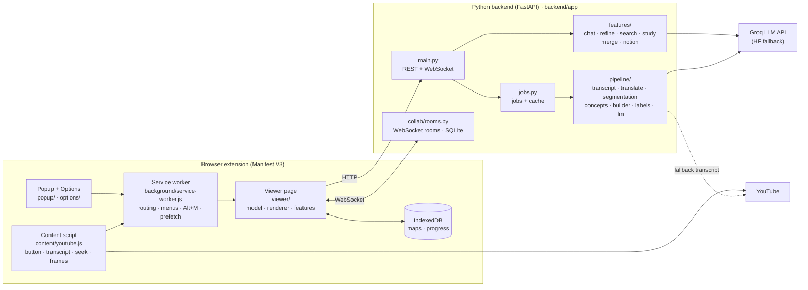

# TubeMind: complete project guide

TubeMind turns any YouTube video, in any language, into an English, hand-drawn, **timestamp-linked mindmap** that you can revise from in minutes. Click any timestamp and the video jumps to that moment.

This guide explains everything the project contains: the architecture, how every feature works and how it is built, and how to use it efficiently. For the original README see [README.md](../README.md); for performance measurements see [OPTIMIZATION_README.md](../OPTIMIZATION_README.md).

## Contents
 
1. [The big picture](#1-the-big-picture)
2. [Architecture](#2-architecture)
3. [What happens when you click "Mindmap"](#3-what-happens-when-you-click-mindmap)
4. [The map-building pipeline (backend)](#4-the-map-building-pipeline-backend)
5. [Features in the viewer](#5-features-in-the-viewer)
6. [Settings](#6-settings)
7. [Keyboard shortcuts and voice commands](#7-keyboard-shortcuts-and-voice-commands)
8. [How to use TubeMind efficiently](#8-how-to-use-tubemind-efficiently)
9. [Backend API](#9-backend-api)
10. [Data: the mindmap format and where things are stored](#10-data-the-mindmap-format-and-where-things-are-stored)
11. [Project structure](#11-project-structure)
12. [Running, testing and deploying](#12-running-testing-and-deploying)
13. [Known limitations](#13-known-limitations)

---

## 1. The big picture

TubeMind has two parts:

| Part | Technology | Job |
|---|---|---|
| **Browser extension** | Chrome/Edge, Manifest V3, plain JavaScript (no framework, no build step) | Adds the Mindmap button to YouTube, collects the transcript, draws and edits the map, studying, exporting |
| **Backend server** | Python 3.10+, FastAPI | Translates, finds sections and concepts, builds the map, calls the AI, hosts collaboration rooms |

Design principles that run through the whole project:

- **The map is built without AI first.** The structure, timestamps and text all come from the transcript using classic NLP. The AI only *rewrites labels* afterwards in one call. If the AI is slow, rate-limited or missing, you still get a complete map.
- **One AI call per map.** This keeps it fast and fits within free AI tiers.
- **Every node points to a real moment** in the video (`start`/`end` seconds), so nothing is invented without a source.
- **Everything is an "operation".** Edits, undo/redo, AI changes and collaboration all use the same six operations, so they work together.
- **Private by default.** Maps live in your browser. Video data only goes to *your* backend and the AI provider you configure. The API key never reaches the browser.

---

## 2. Architecture



### The extension's pieces

| Piece | File(s) | What it does |
|---|---|---|
| Content script | `extension/content/youtube.js` | Runs on youtube.com. Injects the 🧠 **Mindmap** button, scrapes the transcript, chapters and storyboard info, seeks the video when you click a timestamp, captures frames, and broadcasts the playback time for "follow along" |
| Service worker | `extension/background/service-worker.js` | Kept small because MV3 workers are short-lived. Opens the viewer tab, sends prefetch requests, routes seeks and frame captures to the right YouTube tab, and owns the right-click menu and the Alt+M shortcut |
| Popup | `extension/popup/` | Toolbar button: backend status dot, map-size choice, **Generate**, paste any video URL, Library, Join room, Settings (and Demo in Developer mode) |
| Options | `extension/options/` | The settings page, autosaved. Tests the backend connection and asks for host permission when you enter a remote backend URL |
| Shared settings | `extension/shared/settings.js` | Default settings, stored in `chrome.storage.sync` so they follow you across browsers. Migrates settings from older versions |
| Viewer | `extension/viewer/` | The full-page mindmap app: drawing, editing, every feature in section 5 |

### Inside the viewer

| Layer | Files | Role |
|---|---|---|
| App shell | `viewer/js/app.js`, `viewer.html`, `viewer.css` | Starts everything, toolbar, keyboard shortcuts, progress screen |
| Model | `viewer/js/mindmap/model.js` | `MindMapModel`, the single source of truth. Applies operations, keeps undo/redo history, emits `change` events |
| Layout | `viewer/js/mindmap/layout.js` | Computes node positions for the Balanced, Logical tree and Radial layouts |
| Drawing | `viewer/js/mindmap/sketch.js`, `renderer.js`, `themes.js` | Hand-drawn SVG engine with no libraries; pan, zoom, select, edit |
| Features | `viewer/js/features/*.js` | Content map, inspector, assistant, search, refine, study, voice, collab, gamify, library, frames, export |
| Helpers | `viewer/js/lib/api.js`, `storage.js`, `util.js` | Backend client, IndexedDB, small DOM helpers |

### The backend's pieces

| Folder | Files | Role |
|---|---|---|
| `backend/app/` | `main.py`, `config.py`, `jobs.py`, `cli.py` | API routes, `.env` settings, background jobs + disk cache, command-line tool |
| `backend/app/pipeline/` | `transcript`, `translate`, `segmentation`, `concepts`, `embeddings`, `builder`, `labels`, `llm`, `tone`, `multimodal`, `text_utils` | The map-building pipeline (section 4) |
| `backend/app/features/` | `chat`, `refine`, `search`, `study`, `merge`, `notion`, `treeutil` | On-demand features the viewer calls |
| `backend/app/collab/` | `rooms.py`, `ops.py` | Collaboration rooms, WebSocket protocol, SQLite storage, team gamification |

---

## 3. What happens when you click "Mindmap"

```mermaid
sequenceDiagram
    participant YT as YouTube tab
    participant SW as Service worker
    participant V as Viewer tab
    participant B as Backend
    participant L as LLM (1 call)

    Note over YT,B: Before you click (prefetch)
    YT->>SW: page loaded → title, transcript, chapters, caption language
    SW->>B: POST /api/prefetch (no AI)
    B->>B: translate if needed → build map → cache it

    Note over YT: You click 🧠 Mindmap (or Alt+M)
    YT->>SW: video context
    SW->>V: open viewer tab
    V->>B: POST /api/jobs
    B-->>V: complete map at once (from cache, ~10 ms; or built now, ~0.3–1 s)
    V->>V: draw map
    V->>B: GET /api/jobs/{id}?wait=20 (long-poll)
    B->>L: one compact prompt
    L-->>B: rewritten labels (cut at 1.2 s deadline)
    B-->>V: "update" operations
    V->>V: labels change in place
```

1. **Prefetch.** About 2.5 seconds after a watch page loads, the content script sends the video's details to the backend. The backend translates the transcript if needed and builds and caches the map, **without calling the AI**.
2. **Click.** You click the button, press Alt+M, right-click, or use the popup. A viewer tab opens.
3. **Instant map.** The viewer asks for the map. If prefetch finished it comes back in milliseconds; otherwise it is built on the spot (usually under a second for English).
4. **AI polish.** The viewer waits on a "long-poll" while the backend makes **one** AI call to rewrite labels. The rewrites arrive as `update` operations and the labels change in place.
5. **Saved.** The map is saved in your browser's IndexedDB automatically.

Command-line alternative (no extension needed):
```bash
cd backend
python -m app.cli "https://www.youtube.com/watch?v=<ID>" --mode academic --out ../examples/my-lecture.json
```

---

## 4. The map-building pipeline (backend)

Each stage below has three parts: **what** it does, **how** it works, and **where** it is built.

### 4.1 Getting the transcript

- **What:** gets the spoken text with timestamps.
- **How:** tries sources in this order:
  1. The transcript the extension scraped in your browser, using the same internal YouTube call as the "Show transcript" panel, then the caption-track JSON.
  2. `youtube-transcript-api` on the server: manual captions, then auto captions, then YouTube's auto-translation.
  3. **Whisper** speech-to-text: `yt-dlp` downloads the audio and `faster-whisper` transcribes it locally. Optional, needs `requirements-ml.txt`.

  The text is then cleaned: noise tags like `[Music]`, filler words, repeated rolling captions and speaker markers are removed. It is grouped into ~25-second "blocks" that later stages treat as documents.
- **Where:** `backend/app/pipeline/transcript.py`, `text_utils.py`; scraping in `extension/content/youtube.js`.

### 4.2 English maps from any language (translation)

- **What:** non-English videos become English maps, while timestamps stay correct.
- **How:**
  1. **Detect the language once** (≈1 ms). It uses the caption language as a hint, the Unicode script (e.g. Devanagari → Hindi), the ratio of English stop-words, and `langdetect` as the final judge.
  2. **English videos skip translation** completely (0 ms).
  3. Other languages are split into sentence-sized units and translated with **NLLB-200 distilled 600M**, a free Meta model, run with CTranslate2 int8 on the CPU. The model is loaded **once** when the server starts.
  4. **Coarse-to-fine order:** every 8th unit first, then the gaps. At any moment the translated part covers the *whole* video evenly. If you click before translation finishes, you get a **quick map** built from that part, with a "Refresh" notice.
  5. Each translated unit keeps the original start/end times, so timestamps still work.
  6. Progress is checkpointed to disk (`backend/data/cache/translated/`), so a restart resumes it and a second visit costs nothing.
  7. A final **guard** re-translates any node text still in a non-Latin script.
- **Where:** `backend/app/pipeline/translate.py`; model setup with `scripts/convert_nllb.py`.

### 4.3 Splitting into sections (segmentation)

- **What:** divides the video into logical sections.
- **How:**
  1. If the creator added **chapters** (player markers, or `0:00 Intro` lines in the description), they are used directly.
  2. Otherwise a **TextTiling**-style algorithm compares the meaning of neighbouring blocks and cuts where the topic changes most (the "valleys" in similarity). Speaker changes add weight.
  3. **LDA** topic modelling gives each section a topic, **c-TF-IDF** (as in BERTopic) picks each section's keywords, and clustering groups sections into themes.
- **Where:** `backend/app/pipeline/segmentation.py`.

### 4.4 Finding key concepts (knowledge graph)

- **What:** finds the real ideas in the video ("Gradient descent"), not random phrases.
- **How:**
  1. Candidate phrases come from noun phrases (spaCy if installed, otherwise filtered 1–3-word TF-IDF features).
  2. **TF-IDF** ranks phrases that are specific to one section higher.
  3. Near-duplicates ("neural net" and "neural networks") are merged using sentence **embeddings**: real BERT (`all-MiniLM-L6-v2`) if installed, otherwise TF-IDF + SVD (LSA).
  4. A **knowledge graph** (networkx) links concepts that appear together or mean similar things. **PageRank** finds the most important concepts, and simple patterns ("X is a Y", "X uses Y") label the links ("is a type of", "uses", "leads to"). These become the dashed cross-links on the map.
- **Where:** `backend/app/pipeline/concepts.py`, `embeddings.py`.

### 4.5 Assembling the "revision sketchbook"

- **What:** builds the actual tree you see.
- **How:** every level is built from the transcript **without AI**:

| Level | Content | How it's made |
|---|---|---|
| 0 Topic | Video title + one-line summary | Title (translated if needed) |
| 1 Sections | Numbered, with time range (`12:40–18:05`) and a 1–2 sentence summary | Segmentation + the **summary retriever**, which picks the most representative sentences with "centroid + MMR" ranking in 1–10 ms |
| 2 Concepts | `Term: meaning` | A defining sentence ("X is / means / refers to …"), shortened to ≤10 words |
| 3 Items | `Def:`, `Eg:`, `Formula:`, `Tip:`, `Watch-out:` | Sentences about the concept, classified by cue words ("for example", "=", "careful", "remember"…) |
| Quick recall | "In one line" + 3–6 must-remember points | The sections' top summary sentences |
| 4 Quotes | Exact transcript lines | Stored for search, study and chat, **never drawn** |

  **Map sizes:**
  - **Short** (default, for exam revision) and **Standard**: concepts start collapsed with `+N`.
  - **Detailed**: everything unfolded, up to 5 lines per concept.

  Every node also stores a faithfulness score (how well it matches its source sentence).
- **Where:** `backend/app/pipeline/builder.py`.

### 4.6 The single AI rewrite

- **What:** makes labels read naturally, in **one** AI call per map.
- **How:**
  1. The backend sends a compact numbered list of candidates. The AI answers in short pipe-separated lines:
     ```
     R|Vector stores in LangChain          ← topic
     M|How vector stores keep and search embeddings   ← one-line summary
     S|s1|Movie plot similarity|Compares plots with embeddings   ← section
     C|c1|Embedding: numeric vector that captures meaning        ← concept
     D|d1|Eg|Recommend movies with similar plots                  ← detail
     X|c2>c7|leads to                                             ← cross-link
     ```
  2. A **tolerant parser** accepts what is valid and keeps the original text for anything missing, broken, non-English, a duplicate, or "meta" ("the speaker says…").
  3. **The AI never changes structure or timestamps,** only wording.
  4. The call has a **1.2-second hard deadline**. Whatever arrived is kept, in priority order: recall and sections first, then concepts in video order.
  5. Results are **cached per section**, so reopening a map costs 0 AI calls. A rate-limit (429) pauses AI calls for the time Groq asks, and the map stays complete with its original labels.
- **AI providers** (`llm.py`): **Groq** first (fast, free tier), then a Groq fallback model, then the **Hugging Face** router, then a **local** transformers model. One shared HTTP connection; every call's tokens are counted in the logs.
- **Where:** `backend/app/pipeline/labels.py`, `llm.py`.

### 4.7 Tone tags

- **What:** tags sections as `enthusiastic`, `critical`, `controversial`, `cautionary`, `humorous` or `instructional`.
- **How:** a transparent word-list scorer, so tags exist even offline; merged with the AI's judgement when available.
- **Where:** `backend/app/pipeline/tone.py`.

### 4.8 Server keyframes (optional)

- **What:** finds slides, charts and diagrams in the video.
- **How:** `yt-dlp` downloads a low-resolution copy. OpenCV keeps frames that differ strongly from the previous one (a slide change) **and** have many edges (text, charts). Each frame is attached to the nearest node.
- **Where:** `backend/app/pipeline/multimodal.py`. Needs `opencv-python-headless` + `yt-dlp` and the **Server keyframes** setting.

### 4.9 Jobs and caching

- **What:** makes repeat opens instant.
- **How:** a job has two phases: *skeleton* (the full map) and *labels* (the AI ops). Results are cached on disk by `videoId + map size` (plus a format version). Theme, layout and AI on/off never cause a rebuild. An in-memory cache serves hits in 1–4 ms.
- **Where:** `backend/app/jobs.py`, `backend/data/cache/`.

---

## 5. Features in the viewer

### 5.1 The hand-drawn mindmap

- **What:** a mindmap that looks drawn by hand, with numbered sections, clickable timestamps and `+`/`−` toggles.
- **How it's built:** a custom, zero-dependency SVG engine of about 1,800 lines. Manifest V3 forbids remotely loaded code, and the goal was a real sketch look, so no library is used.
  - `sketch.js` generates wobbly lines, highlighter swipes, clouds, bursts and arrows from a **seeded** random generator, so shapes don't jitter on re-render.
  - Node content is **text only**: timestamps are underlined text, and tags are coloured text.
- **Themes** (`themes.js`):
  - **Blackboard** (default): chalk on dark green, with one chalk colour per tag.
  - **Sketch notes**: off-white paper, plum ink, pastel highlighter.
  - **Yellow doodle**: marker shapes on yellow paper.

  All themes use the bundled **Atkinson Hyperlegible** font, at 14 px or larger.
- **Layouts** (`layout.js`):
  - **Balanced (clockwise)** (default): sections split left/right in video order, clockwise.
  - **Logical tree**: grows to the right.
  - **Radial**: branches around the centre.
- **Use:** ☰ menu → theme / layout. Drag to pan, wheel or pinch to zoom, **f** to fit.

### 5.2 Timestamps and "follow along"

- **What:** every node jumps the video to its moment, and the map follows the video as it plays.
- **How:**
  1. Clicking a timestamp sends a `seek` through the service worker to the YouTube tab's content script, which sets `video.currentTime` and optionally switches to that tab.
  2. The content script broadcasts the playback time, and the viewer outlines the matching node in red.
- **Where:** `renderer.js` (seek events), `service-worker.js`, `content/youtube.js`.
- **Use:** click an underlined time, press **p**, or say "play". Toggle with the **Follow along** and **Switch to video on jump** settings.

### 5.3 Content map

- **What:** the whole video as a numbered outline you can read in under a minute.
  - Topic and "In one line"
  - Quick recall
  - Jump to (every section)
  - For each section: summary, key terms, `Term: meaning` lines and tagged lines
- **How:** `outline(map)` is a pure function that turns the map into plain data, shared by the panel, the Markdown export and the tests. Selection syncs both ways: click an entry to focus its node (sections also play the video), or select a node to highlight its entry.
- **Where:** `viewer/js/features/contentmap.js`.
- **Use:** the **Content map** button.

### 5.4 Layers: Concepts / Details

- **What:** controls how much is shown.
- **Use:** **Concepts** (key **1**) shows sections and terms. **Details** (key **2**) unfolds every concept's Def / Eg / Formula / Tip / Watch-out lines. A single concept's `+N` opens just that concept.

### 5.5 Editing, undo/redo and the operations model

- **What:** a fully editable map.
- **How:** every change is one of six **operations**: `add`, `update`, `remove`, `move`, `edge:add`, `edge:remove`. `model.js` applies each op and stores its **inverse** for undo. The exact same ops are returned by AI refine and sent to collaborators, so everything is undoable and syncs. The backend mirror is `collab/ops.py`; the two must stay in sync.
- **Use:** double-click / **F2** / **e** to edit. **Tab** adds a child, **Enter** a sibling, **Delete** removes. **Space** expands/collapses. **Ctrl+Z / Ctrl+Y** undo/redo.

### 5.6 Node inspector (right panel)

- **What:** everything about the selected node: text, summary, notes, external links, an image, tone tags, timestamps, cross-links, AI buttons and the chat.
- **Where:** `viewer/js/features/panel.js`.
- **Use:**
  - Select a node to open the panel.
  - To cross-link two nodes, select both (Shift+click) and click **⤳ Cross-link**.

### 5.7 Images from the video (multimodal)

- **What:** attach a picture of the video to a node.
- **How:** three sources:
  - **🎞 Storyboard frame**: YouTube publishes sprite sheets of small thumbnails for its seek bar. TubeMind crops the one for the node's timestamp. It's free and instant, with no download.
  - **📸 Capture frame**: grabs the exact frame playing in the YouTube tab at full resolution. Best for slides.
  - **⬆ Upload**: any local image.
- **Where:** `viewer/js/features/frames.js`, `content/youtube.js`; server keyframes in `multimodal.py`.
- **Use:** inspector panel → image buttons. Images show in the panel, not inside map nodes.

### 5.8 Node assistant (chat)

- **What:** ask anything about a node, e.g. "explain this simpler" or "why does this matter?".
- **How:** the backend does **retrieval** instead of sending the whole transcript. The prompt carries the node's path, its summary and the 5–8 most similar transcript sentences (≈1,500 tokens max). One streamed AI call per message. Answers cite moments as **▶ chips** that seek the video. Without an AI, it answers with the best-matching transcript lines.
- **Where:** `viewer/js/features/assistant.js`, `backend/app/features/chat.py` (`POST /api/chat`, streamed NDJSON).
- **Use:** select a node and press **a**, or use the chat dock in the right rail.

### 5.9 AI refinement

- **What:** five actions on selected nodes:
  - **Expand**: add sub-points
  - **Rewrite**: clearer wording
  - **Summarize**
  - **Reorganize**: regroup the children
  - **Merge**: combine nodes

  You can add an instruction, e.g. "add real-world examples".
- **How:** the backend returns **operations**, applied as one undoable step and shared with collaborators. Provider chain: Groq → Groq fallback → Hugging Face → local model. Basic offline fallbacks keep Expand working without AI.
- **Where:** `viewer/js/features/refine.js`, `backend/app/features/refine.py`.
- **Use:** right-click a node, or the inspector's AI buttons.

### 5.10 Search

- **What:** find any node by words *or meaning*. For example, "entangled particles" finds "Entanglement: linked quantum states".
- **How:** instant local fuzzy matching while you type. **Enter** runs **semantic search** on the backend: embeddings plus a boost for exact words. Hits inside hidden transcript quotes open their parent node.
- **Where:** `viewer/js/features/search.js`, `backend/app/features/search.py`.
- **Use:** **/** or **Ctrl+F**, type, then **Enter** for meaning-based results.

### 5.11 Study mode

- **What:** flashcards and quizzes made from the map.
- **How:**
  - **Flashcards use Leitner boxes** (spaced repetition). Every card starts in Box 1. After flipping a card you grade it:
    - **↺ Again** sends it back to Box 1.
    - **✓ Good** moves it up one box.
    - **★ Easy** moves it up two boxes.

    Cards in lower boxes are shown first, and Box 5 cards are retired. A card that reaches Box 4 marks its node as **mastered** on the map.
  - **Quizzes** are multiple choice with 4 options, an explanation and a "watch this moment" link.
  - Cards come from the AI, or offline from `Term: meaning` nodes, using other concepts' meanings as wrong options.
- **Where:** `viewer/js/features/study.js`, `backend/app/features/study.py`. Progress is stored in IndexedDB.
- **Use:** **🎓 Study**.

### 5.12 Gamification

- **What:** XP, levels, badges and team challenges to keep you going.
- **How:**
  - **Points:**

    | Action | Points |
    |---|---|
    | Add a node | 5 |
    | Merge a map | 5 |
    | Correct quiz answer | 4 |
    | Write a note | 3 |
    | Add a link | 3 |
    | Edit a node | 2 |
    | Correct flashcard | 2 |
    | Use AI refine | 2 |
    | Explore a node | 1 |

  - **Levels:** reaching level *n* takes 10·(n−1)² XP.
  - **Badges:**

    | Badge | How to earn it |
    |---|---|
    | 🌱 First Steps | Earn your first point |
    | 🧭 Explorer | Explore 25 nodes |
    | ✍️ Scribe | Write 10 notes |
    | 🏗️ Architect | Add or edit 20 nodes |
    | 🔗 Curator | Attach 5 links |
    | 🏆 Quiz Whiz | 10 correct quiz answers |
    | 🧠 Memory Master | Remember 25 flashcards |
    | 🤝 Team Player | Study in a shared room |

  - **In a shared room,** the server keeps a team leaderboard and three group challenges: explore every section together, visit 75% of nodes as a group, and answer 20 quiz questions correctly as a team.
- **Where:** `viewer/js/features/gamify.js` (solo, stored in `chrome.storage.local`), `backend/app/collab/rooms.py` (team).
- **Use:** the HUD card shows level, XP and % explored. Click it for badges and challenges.

### 5.13 Voice control

- **What:** control the map hands-free.
- **How:** the browser's Web Speech API recognises commands, and text-to-speech reads nodes aloud. In Chrome, recognition is processed by Google's speech service.
- **Where:** `viewer/js/features/voice.js`.
- **Use:** click **🎙**. Commands are listed in [section 7](#7-keyboard-shortcuts-and-voice-commands); say "help" for the list.

### 5.14 Live collaboration

- **What:** several people edit and study one map at the same time, with presence dots showing who is looking at which node.
- **How:**
  - **Rooms:** each room holds one map, stored in SQLite (`backend/data/tubemind.db`).
  - **The server is the source of truth:** it applies operations in arrival order and stamps a version number.
  - **Clients apply their own edits immediately,** then re-apply them in the server's order when the echo comes back, so everyone ends up with the same map.
  - **A version gap** triggers a full snapshot.
  - **Offline edits** can be combined with **Merge my version**.
  - **WebSocket protocol:** client → server `hello · op · presence · event · sync · merge`; server → client `snapshot · op · presence · leaderboard · badge · error`.
- **Where:** `viewer/js/features/collab.js`, `backend/app/collab/rooms.py`.
- **Use:** **👥 Share** creates a room code. Others use **Join room** in the popup. Everyone must use the same backend URL. Rooms have no passwords, so treat the code like a share link.

### 5.15 Library, Knowledge Hub and merging

- **What:**
  - **Library:** all your saved maps; open, delete or import them.
  - **🔗 Link knowledge:** select 2+ videos and get a **Knowledge Hub** map where overlapping concepts are merged and each leaf jumps to its own video.
  - **Merge maps:** unify several versions, e.g. two students' maps of the same lecture.
- **How:** the backend compares node meanings with embeddings and unifies similar children. It combines notes and links and records provenance in `sources`.
- **Where:** `viewer/js/features/library.js`, `backend/app/features/merge.py` (`/api/link`, `/api/merge`).
- **Use:** ☰ → **Library**. Drag a `.tubemind.json` file onto the canvas to import it.

### 5.16 Export

| Format | Good for |
|---|---|
| **JSON** | Full backup; re-import later |
| **PNG / SVG** | Images in the current theme, fonts embedded |
| **Markdown** | Revision notes: Quick recall, `## 1. Section · [12:40–18:05](link)`, `**Eg:**` lines |
| **Obsidian** | Frontmatter, `[[wikilinks]]`, callouts, `related::` links |
| **Roam** | Roam Research JSON import |
| **OPML** | XMind, MindNode, Logseq, Workflowy, OmniOutliner |
| **Notion** | Markdown import, or a direct push via the API (needs `NOTION_TOKEN` + `NOTION_PARENT_PAGE_ID` in `.env`) |

- **Where:** `viewer/js/features/export.js` (all formats generated in the browser), `backend/app/features/notion.py` (API push).
- **Use:** **⤓ Export**.

### 5.17 Developer mode

- **What:** shows model names, pipeline stages, timings and the bundled demo map. Off by default to keep the interface simple.
- **Use:** Settings → **Developer mode**. The popup then shows **🧪 Demo**, which opens a sample map with no backend needed.

---

## 6. Settings

### Extension (⚙ Settings page, saved in `chrome.storage.sync`)

| Setting | Default | What it does |
|---|---|---|
| Backend URL | `http://127.0.0.1:8765` | Where the backend runs. A remote URL triggers a permission request |
| Map size | **Short** | Short (exam revision) · Standard · Detailed (internally `revision` / `academic` / `deep`) |
| Theme | **Blackboard** | Blackboard · Sketch notes · Yellow doodle |
| Layout | **Balanced (clockwise)** | Balanced · Logical tree · Radial |
| AI rewrite | On | The single AI label call per map |
| Prefetch | On | Build the map in the background while you watch |
| Speech-to-text (Whisper) | On | Allow the Whisper fallback (needs the ML extras on the server) |
| Server keyframes | Off | Slide/chart detection on the server |
| Storyboard thumbnails | On | Free frames from YouTube's storyboards |
| Switch to video on jump | On | Bring the YouTube tab forward when a timestamp is clicked |
| Follow along | On | Highlight the node matching the playback time |
| Voice language | `en-US` | Language for voice commands |
| Display name & colour | — | How you appear in collaboration rooms |
| Developer mode | Off | See 5.17 |

### Backend (`.env` file at the project root)

| Variable | Default | Purpose |
|---|---|---|
| `GROQ_API_KEY` | — | **Required for AI.** Free key from console.groq.com |
| `GROQ_MODEL` / `GROQ_FALLBACK_MODEL` | `llama-3.3-70b-versatile` / `llama-3.1-8b-instant` | Models for refine and study |
| `GROQ_LABEL_MODEL` | auto | Fast model for the label call and chat (empty = fastest live model) |
| `LABEL_TIMEOUT`, `CHAT_TIMEOUT` | `1.2`, `12.0` | Deadlines in seconds. Raise `LABEL_TIMEOUT` to ~3 for fully rewritten maps |
| `NLLB_ENABLED`, `NLLB_MODEL_PATH` | `1`, `backend/data/models/nllb-…-ct2-int8` | Translation on/off and model folder |
| `HF_TOKEN`, `HF_MODEL`, `HF_LOCAL_MODEL` | — | Hugging Face and local AI fallbacks |
| `EMBEDDING_MODEL` | `all-MiniLM-L6-v2` | BERT embeddings (if installed) |
| `WHISPER_MODEL` | `base` | Whisper size |
| `HOST`, `PORT`, `CORS_ORIGINS` | `127.0.0.1`, `8765`, `*` | Server binding |
| `NOTION_TOKEN`, `NOTION_PARENT_PAGE_ID` | — | Enables "Push to Notion" |

`GET /api/health` shows which capabilities are active.

---

## 7. Keyboard shortcuts and voice commands

### Keyboard

| Key | Action |
|---|---|
| **Alt+M** (on YouTube) | Generate a mindmap |
| Click / Shift+click | Select / multi-select |
| Arrow keys | Move between nodes |
| **Space** | Expand / collapse |
| **Enter** | Add sibling |
| **Tab** | Add child |
| **F2** or **e** | Edit text |
| **Delete** / Backspace | Remove node |
| **p** | Play the video at this node |
| **a** | Ask the assistant about this node |
| **1** / **2** | Concepts / Details layer |
| **/** or **Ctrl+F** | Search (Enter = semantic search) |
| **f** | Fit map to screen |
| **+** / **−** | Zoom in / out |
| **Esc** | Clear selection |
| **?** | Show help |

### Voice (click 🎙 first)

| Say | Does |
|---|---|
| "expand / open *topic*", "collapse / close *topic*" | Open or close a branch |
| "go to / show / select *topic*" | Jump to a node |
| "play / watch [*topic*]" | Play the video at that node |
| "read / explain [*topic*]" | Read the node aloud |
| "next", "previous", "parent", "child" | Move around |
| "zoom in", "zoom out", "fit" | View |
| "search *query*" | Search |
| "layer concepts", "layer details" | Switch layer |
| "add note *text*", "add child *text*" | Edit by voice |
| "undo", "redo", "stop listening", "help" | Other |

---

## 8. How to use TubeMind efficiently

### Get faster maps
- **Let prefetch work.** Open the video and start watching. By the time you click, the map is usually ready instantly. For non-English videos this matters most: translation runs in the background, about 1.5 minutes for a 50-minute lecture on a weak laptop.
- **Reopening is free.** Maps are cached by video and map size, so changing theme, layout or AI on/off never rebuilds.
- **If you see "quick map",** keep watching and click **Refresh** later for the full version.
- **Choose videos with captions.** Auto-generated captions are fine. Without captions, the server needs Whisper installed.

### Workflow 1: last-minute exam revision (5 minutes)
1. Map size **Short** (the default) with the **Blackboard** theme.
2. Open the **Content map** and read **Quick recall** first.
3. Skim sections by number. Press **2 (Details)** only for sections you're unsure of.
4. Click a timestamp to rewatch just the confusing 30 seconds.
5. Export to **Markdown** to keep a one-page summary.

### Workflow 2: deep study of a lecture
1. Map size **Detailed**.
2. Use **follow along** while watching. Pause and add **notes** in the inspector.
3. Press **a** on any confusing node and ask the assistant. Its ▶ chips take you to the exact moment.
4. Use **AI refine → Expand** with an instruction like "add a worked example".
5. **📸 Capture frame** on slides you want to keep.
6. Finish with **🎓 Study**: do flashcards daily until nodes show as mastered.

### Workflow 3: group study
1. One person clicks **👥 Share** and sends the room code. Everyone must use the same backend URL.
2. Split the sections: each person explores and annotates theirs.
3. Do the quiz together to complete the **team challenges** on the leaderboard.
4. If someone edited offline, they use **Merge my version**.

### Workflow 4: a topic across several videos
1. Make maps for 2–5 videos on the same topic.
2. ☰ → **Library** → select them → **🔗 Link knowledge**.
3. The Knowledge Hub shows shared concepts, each linked to every video that explains it.
4. Export to **Obsidian** to keep it in your notes vault.

### Tips
- Use **semantic search** (type, then **Enter**) when you remember the idea but not the words.
- Keep **AI rewrite on**. It costs one small call per map, and reopening costs nothing.
- If you hit Groq's free-tier limit (429), the map is still complete. AI calls resume after a short pause.
- Back up important maps with **Export → JSON**. Maps live in one browser's IndexedDB, and clearing site data deletes them.

---

## 9. Backend API

Interactive docs: `http://127.0.0.1:8765/docs`.

| Method | Path | Purpose |
|---|---|---|
| GET | `/api/health` | Active capabilities (LLM, embeddings, translation, Whisper, keyframes, Notion) |
| POST | `/api/jobs` | Build a map: returns `{map, jobId, pending, cached}` |
| GET | `/api/jobs/{id}?wait=20&hasMap=1` | Long-poll for the AI label operations |
| POST | `/api/prefetch` | Build and cache a map in the background, no AI |
| POST | `/api/chat` | Node assistant, streamed NDJSON (`sources`, `delta`, `done`) |
| POST | `/api/transcript` | Transcript only |
| POST | `/api/refine` | AI refine: returns operations |
| POST | `/api/search` | Semantic search: returns ranked node ids |
| POST | `/api/study` | Flashcards + quiz |
| POST | `/api/merge` | Merge maps |
| POST | `/api/link` | Cross-video links + Knowledge Hub |
| POST | `/api/export/notion` | Push to Notion |
| POST / GET / PUT | `/api/rooms[/{id}]` | Create / fetch / replace a room |
| POST | `/api/rooms/{id}/merge` | Merge a map into a room |
| WS | `/ws/rooms/{id}` | Live collaboration |

---

## 10. Data: the mindmap format and where things are stored

### Mindmap document (`schema: "tubemind/1"`)

```jsonc
{
  "schema": "tubemind/1",
  "id": "…", "version": 3,
  "meta": { "videoId": "…", "title": "…", "duration": 1440, "mode": "revision",
            "language": "en", "sourceLanguage": "hi", "transcriptSource": "youtube-captions", "llm": "groq:…" },
  "root": {
    "id": "n-…", "type": "root", "layer": 0, "text": "Central idea", "summary": "…",
    "start": 0, "end": 1440, "tone": [], "notes": "", "links": [], "collapsed": false,
    "children": [ /* section → concept → detail (with "tag") → transcript; last: { "recall": true } */ ]
  },
  "edges": [ { "id": "e-…", "source": "n-a", "target": "n-b", "label": "leads to" } ],
  "segments": [], "graph": { "concepts": [], "edges": [] },
  "transcript": [ { "start": 0, "end": 4.2, "text": "…" } ]
}
```

### Where data lives

| Data | Location |
|---|---|
| Your maps, study progress, explored nodes | Browser **IndexedDB** (`viewer/js/lib/storage.js`) |
| Settings | `chrome.storage.sync` |
| Solo XP and badges | `chrome.storage.local` (key `tm-gamify`) |
| Map cache, translation cache | `backend/data/cache/` |
| Collaboration rooms, team stats | `backend/data/tubemind.db` (SQLite) |
| Translation model | `backend/data/models/` |
| API keys | `.env` at the project root (server only, git-ignored) |

---

## 11. Project structure

```
youtube-extension/
├── .env                       # your keys (git-ignored)
├── README.md                  # original project README
├── OPTIMIZATION_README.md     # performance work and measurements
├── SESSION_LOG.md             # deployment session log
├── backend/
│   ├── requirements.txt       # core (no GPU / torch)
│   ├── requirements-ml.txt    # optional: BERT, Whisper, OpenCV, spaCy, transformers
│   ├── app/
│   │   ├── main.py            # FastAPI routes + start-up warm-up
│   │   ├── config.py          # .env settings
│   │   ├── jobs.py            # background jobs + cache
│   │   ├── cli.py             # command-line map builder
│   │   ├── pipeline/          # transcript · translate · segmentation · concepts · embeddings
│   │   │                      # builder · labels · llm · tone · multimodal · text_utils
│   │   ├── features/          # chat · refine · search · study · merge · notion · treeutil
│   │   └── collab/            # rooms (WebSocket + SQLite + team gamification) · ops
│   ├── data/                  # cache, models, SQLite (git-ignored)
│   └── tests/                 # pytest: pipeline, labels, translate
├── extension/
│   ├── manifest.json
│   ├── background/service-worker.js
│   ├── content/youtube.js · youtube.css
│   ├── popup/ · options/
│   ├── shared/settings.js · fonts.css
│   ├── fonts/                 # Atkinson Hyperlegible (bundled)
│   ├── icons/
│   ├── viewer/
│   │   ├── viewer.html · viewer.css · demo/sample-map.json
│   │   └── js/
│   │       ├── app.js
│   │       ├── mindmap/       # model · layout · sketch · themes · renderer
│   │       ├── features/      # contentmap · panel · assistant · search · refine · study
│   │       │                  # voice · collab · gamify · library · frames · export
│   │       └── lib/           # api · storage · util
│   └── tests/                 # node --test (no dependencies)
├── examples/sample-lecture-mindmap.json
├── scripts/                   # build_demo · make_icons · convert_nllb · bench_sketchbook
├── docs/                      # screenshots + this guide
└── dist/                      # packaged extension zip (git-ignored)
```

---

## 12. Running, testing and deploying

### Run locally

```bash
# Backend
cd backend
python -m venv .venv
.venv\Scripts\activate             # macOS/Linux: source .venv/bin/activate
pip install -r requirements.txt
# create .env at the project root with GROQ_API_KEY=...
python -m app.main                 # → http://127.0.0.1:8765
```

- **Optional extras:** `pip install -r requirements-ml.txt` and `python -m spacy download en_core_web_sm`.
- **Translation model (one time):** `python ../scripts/convert_nllb.py`. It downloads about 2.5 GB and leaves about 620 MB on disk.
- **Extension:** `chrome://extensions` → Developer mode → **Load unpacked** → choose `extension/`. There is no build step: edit files, then click ↻.

### Tests

```bash
cd backend && python -m pytest -q          # offline: mock LLM, fake NLLB
node --test extension/tests/*.test.js      # viewer tests, tiny DOM shim, no npm install
```

### Share with testers (free, no card)

Run the backend on your PC and expose it with a Cloudflare Quick Tunnel:
```bash
cloudflared tunnel --url http://127.0.0.1:8765
```
Testers load the zipped extension and paste the `https://….trycloudflare.com` link into **Options → Backend URL**. See [SESSION_LOG.md](../SESSION_LOG.md) for the full steps and limits.

### Deploy permanently

| Need | Option |
|---|---|
| Always-on backend with translation | Oracle Cloud Always Free VM (2 ARM cores / 12 GB RAM; card for verification only), behind Caddy for HTTPS |
| Backend without translation | Render free tier with `NLLB_ENABLED=0` (512 MB RAM, sleeps when idle) |
| Publish the extension | Microsoft Edge Add-ons (free) · Chrome Web Store (one-time US$5) · GitHub Releases |

**Before a public release:**
1. Set `backendUrl` in `extension/shared/settings.js` to your HTTPS server.
2. Remove the `localhost` entries from `host_permissions`.
3. Write a privacy policy.
4. Add authentication to rooms and rate limits to the API.

---

## 13. Known limitations

- **Transcript scraping depends on YouTube internals.** If YouTube changes them, the server fallbacks take over. YouTube also often blocks transcript requests from cloud servers, so a home-hosted backend works best.
- **Translation on a CPU is slow for cold videos.** About 133 tokens/s on a 2-core laptop, so a 50-minute lecture takes about 1.5 minutes. Prefetch hides most of this.
- **Romanised speech** (e.g. Hinglish in Latin letters) is treated as English and not translated.
- **Partial AI rewrites.** With the 1.2 s deadline, about half the labels of a 6-section map are AI-rewritten; the rest keep their plainer heuristic text. Raise `LABEL_TIMEOUT` for full rewrites.
- **Free Groq tiers are rate-limited.** Several maps per minute can hit a 429. Maps stay complete, without AI polish.
- **Storyboard thumbnails are low resolution** (160–320 px). Use 📸 Capture frame for crisp slides.
- **Collaboration rooms have no authentication.** Anyone with the code and backend URL can join.
- **Voice recognition in Chrome** is processed by Google's speech service.
- **Maps live in one browser.** Export JSON to back them up or move them.
